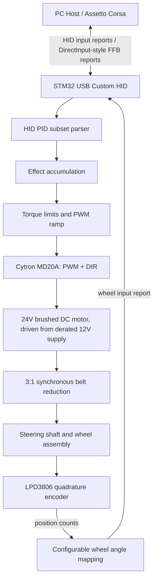
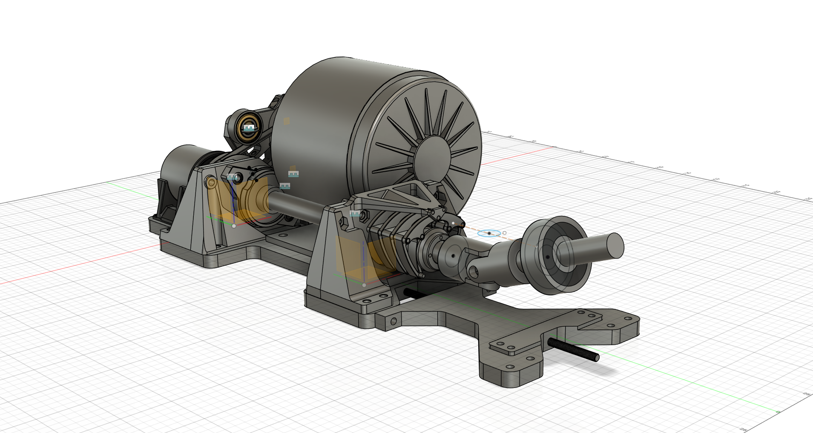
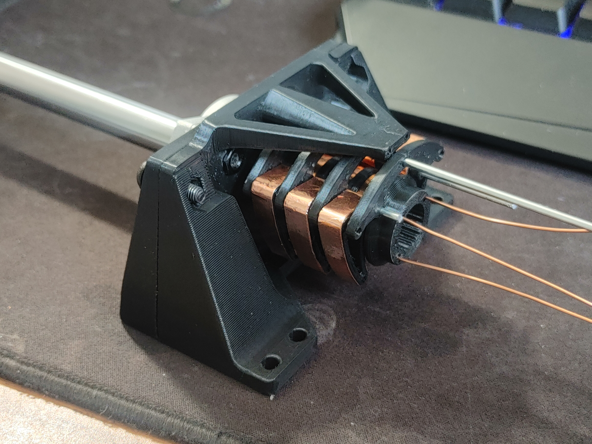
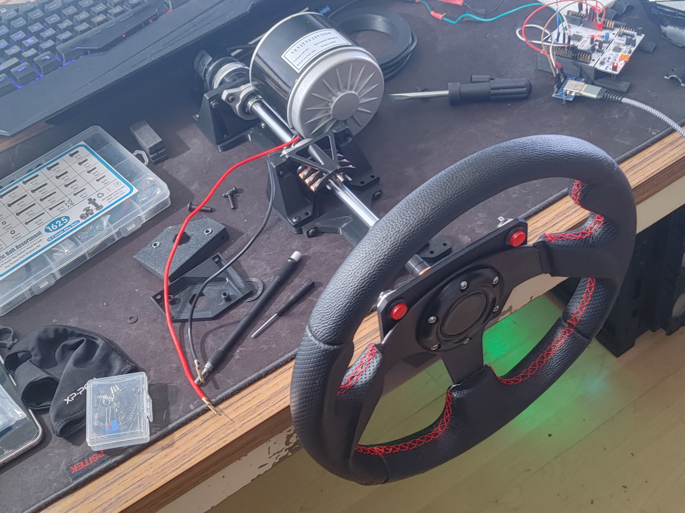

# Racing Wheel Force Feedback Controller

**STM32 / USB HID / Embedded C / Motor Control / CAD and 3D Printing**  
**Personal Project**

## Overview

I designed and prototyped a custom force-feedback racing wheel controller that combined STM32 firmware, USB HID device communication, brushed DC motor control, and custom 3D-printed mechanical components.

The project started from a practical constraint. I was a sim-racing hobbyist who wanted the feel of professional racing-simulator hardware, but commercial force-feedback setups were outside my budget. Existing DIY options had tradeoffs: many low-cost builds did not support force feedback, while more complete builds could become expensive enough that buying a commercial wheel made more sense. I decided to build my own controller to understand the full system and keep the design cost-conscious.

This case study presents the project as a verified embedded systems and mechatronics prototype. It should not be framed as a production-ready commercial wheel.

## Goals

- Build a USB device that could present racing-wheel inputs to a PC through custom HID reports.
- Implement a subset of standard HID PID / DirectInput force-feedback behavior.
- Read steering position from a quadrature encoder and map it into a software-adjustable wheel angle range.
- Drive a brushed DC motor through a motor driver using PWM and direction control.
- Apply local safety limits before converting force-feedback commands into motor torque.
- Design and print mechanical parts for the frame, shaft support, motor coupling, encoder mount, belt drive, and rotary connector support.

## Hardware

| Area | Component |
| --- | --- |
| Development board | NUCLEO-F446RE / STM32F446RE, STM32 Nucleo-64 form factor |
| Motor | Vevitts 24V 350W brushed DC motor |
| Motor driver | Cytron MD20A DC motor driver |
| Encoder | Signswise LPD3806 quadrature rotary encoder, 600 P/R |
| Power | LEDMO S-120-12 AC-to-12V DC switching power supply |
| Transmission | Synchronous belt drive with 3:1 speed reduction |
| Mechanical | CAD-designed and 3D-printed shaft supports, motor adapter, encoder mount, frame, coupling, and rotary connector fixtures |

The 12V supply was also a deliberate derating choice for a 24V motor. It reduced maximum motor output while firmware-side PWM ramping and torque limits were being validated.

## Software and Tooling Stack

| Layer | Tools and technologies |
| --- | --- |
| Firmware | Embedded C, STM32CubeIDE, ARM GCC / GNU Make, STM32 HAL, CMSIS |
| USB device stack | ST USB Device Library, Custom HID class, custom USB HID report descriptors |
| MCU peripherals | USB FS device, GPIO encoder input, TIM PWM output, GPIO direction control, USART debug availability |
| Host and validation | Windows Game Controller panel, Free USB Analyzer, Assetto Corsa, Forza Motorsport 8 compatibility testing |
| Control path | HID PID / DirectInput FFB subset, effect accumulation, bounded torque command, PWM ramp limiting, software-adjustable wheel angle |
| Mechanical tooling | Fusion 360 for industrial and parametric CAD, Cinema 4D for polygon mesh cleanup after export, Bambu Studio for STL/3MF slicing and print iteration |

## Technical Architecture

The device exposed wheel input reports and handled a subset of HID PID / DirectInput-style force-feedback reports. Active effects were combined into a bounded torque command, then passed through a local safety layer before being mapped to MD20A PWM duty cycle and direction output.

## Firmware and USB HID Work

The firmware was built around the STM32 USB Device Library's Custom HID class. The input side reported wheel state, including steering position. The output side implemented a force-feedback command path based on a subset of standard HID PID / DirectInput behavior.

Key firmware responsibilities included:

- Defining custom HID report descriptors for wheel input and FFB-related reports.
- Maintaining report IDs, report sizes, signedness, and byte layout as an explicit host-device interface contract.
- Parsing a subset of HID PID / DirectInput force-feedback reports instead of claiming full protocol compliance.
- Combining multiple active effect contributions into a single bounded torque request.
- Reading the LPD3806 quadrature encoder and mapping counts into a configurable steering-angle range.
- Converting the bounded torque command into MD20A PWM duty cycle and direction output.
- Applying PWM ramp limiting so force did not jump immediately to full output.

One important lesson was that USB HID report descriptors are unforgiving interface contracts. A USB device can enumerate correctly while still behaving incorrectly if the descriptor, report ID, buffer length, byte order, or host-side interpretation diverge.

The hardest software problem was learning how to design HID descriptors for force feedback. Official HID and PID documentation explains the building blocks, but it does not provide a direct recipe for a working racing-wheel FFB descriptor. After several failed descriptor iterations, I studied publicly available Logitech force-feedback wheel documentation and descriptor examples to infer the structure of practical wheel reports. I used those examples as references, then iterated my own descriptor and firmware parsing until the prototype could communicate with the host normally.

## Complete Prototype HID Communication Descriptor

This report descriptor defines the communication surface used by the prototype: wheel input reports, host-to-device FFB parameter reports, device-control reports, and PID status/pool reports. It is the communication definition for the prototype's HID PID subset, not a USB device/configuration descriptor.

The firmware side must keep the report IDs, field order, signedness, and byte widths exactly aligned with this descriptor. Host-to-device reports also require matching OUT report parsing. Device Gain, Create New Effect, PID Block Load, and PID Pool are feature reports, so the firmware needs control-pipe GET_REPORT / SET_REPORT handling for the exposed feature IDs. The PID Device Control report is an array selector field, so the firmware receives command selector values `1` through `6`, not the raw usage IDs `0x97` through `0x9C`.

The descriptor excerpt has been split into [racing_wheel_ffb_hid_descriptor_excerpt.c](racing_wheel_ffb_hid_descriptor_excerpt.c). That file is a documentation and review excerpt, not a complete firmware source file; it omits USB stack integration, descriptor length constants, endpoint callbacks, report parser code, and the feature-report GET_REPORT / SET_REPORT handlers.

## Control and Safety

For a force-feedback wheel, the motor is physically coupled to the user's hands, so the firmware cannot blindly pass host-requested force values to the motor driver. High-torque force-feedback wheels can injure users when firmware, host software, or game behavior fails; unexpected steering motion has to be treated as a safety-critical failure mode.

The safety strategy included:

- Combining host-requested effects into a single torque command.
- Clamping the final command before output.
- Applying PWM ramp limiting so torque increased quickly but progressively.
- Supporting software-adjustable steering angle limits.
- Using a derated 12V supply with a 24V motor.

The custom limit behavior was designed to increase opposing torque rapidly near configured boundaries without creating a sudden unsafe step input.

## Mechanical Design

Mechanical design areas included:

- Main frame and base plate for the wheel assembly.
- Bearing supports for the steering shaft.
- Motor adapter and belt-drive geometry for the 3:1 reduction.
- Encoder mount and encoder-shaft coupling.
- Wheel hub and coupling geometry.
- Rotary connector support for signals passing through the rotating assembly.
- Iterative printed test pieces for fit, clearance, stiffness, and alignment.

## Prototype Images

The CAD screenshots that shows the motor, steering shaft, bearing bracket, belt drive, belt tensioning structure, and frame layout of the force feedback steering wheel mechanism.

The rotary conductive slip ring carries steering-wheel button data to the MCU through the rotating wheel assembly.

The bench assembly photo shows the motor, steering shaft, printed mounts, wheel rim, and STM32 test setup before final electrical connection. The steering wheel is a used golf cart steering wheel that I bought on eBay.

## Debugging and Validation

Validation focused on HID enumeration, host-side FFB traffic, and game-driven motor response.

- Windows Game Controller panel confirmed controller enumeration and steering input reports.
- Free USB Analyzer showed HID / FFB reports from the host before motor-drive mapping was completed.
- Logitech force-feedback wheel descriptor examples were used as references while iterating the HID PID report layout.
- Forza Motorsport 8 did not accept the prototype as a non-whitelisted wheel.
- Assetto Corsa produced game-driven force feedback, including road-feel style forces beyond constant force or spring centering.

## Outcome

The project produced a hardware-software prototype path for a custom force-feedback racing wheel: STM32 firmware, USB HID descriptor work, HID PID / DirectInput FFB subset handling, encoder-based steering feedback, PWM motor-drive control, and CAD-designed 3D-printed mechanical components.

Although the prototype did not end up cheaper than some commercial wheels after repeated iterations, the project was still valuable as an end-to-end engineering exercise. It forced me to consider embedded firmware, USB device protocols, host compatibility, motor control, power derating, mechanical design, and physical debugging as one connected system, and it became one of the most engaging engineering projects I have worked on.

## What I Would Improve Next

This project is from about three years ago. If I were to rebuild it today, I would make the following improvements based on my experience:
- Incorporate firmware, CubeMX configuration, HID descriptor revisions, CAD exports, and slicer files into version control from the beginning.
- Organize the firmware structure more clearly, separating the HID force-effect parser, control policy, and low-level motor driver.
- Replace the brushed DC motor and synchronous belt deceleration structure with direct-drive force feedback actuators, such as servo motor-based drive systems, to reduce transmission flexibility and improve responsiveness.
- Redesign the framework using aluminum profiles and standard industrial parts to reduce the proportion of custom 3D-printed parts in the structural components.
- Add a hardware emergency stop or motor-enable gate to improve testing safety.

