# 赛车方向盘力反馈控制器

**STM32 / USB HID / Embedded C / Motor Control / CAD and 3D Printing**  
**个人项目**

## 概览

我设计并原型化了一个自定义力反馈赛车方向盘控制器，它结合了 STM32 固件、USB HID 设备通信、有刷直流电机控制，以及自定义 3D 打印机械部件。

这个项目源于一个现实约束。我是一个模拟赛车爱好者，想要专业赛车模拟硬件的手感，但商业力反馈设备超出了我的预算。已有的 DIY 方案存在取舍：很多低成本方案不支持力反馈，而更完整的方案又可能变得足够昂贵，以至于直接买一个商业方向盘更合理。因此我决定自己构建一个控制器，理解整个系统，同时让设计保持成本意识。

这份 case study 将该项目呈现为一个经过验证的嵌入式系统与机电一体化原型。它不应被描述为一个生产就绪的商业方向盘。

## 目标

- 构建一个 USB 设备，使其能够通过自定义 HID reports 向 PC 呈现赛车方向盘输入。
- 实现标准 HID PID / DirectInput force-feedback 行为的一个子集。
- 从 quadrature encoder 读取转向位置，并将其映射到一个可软件调节的方向盘角度范围。
- 通过电机驱动板，使用 PWM 和方向控制驱动有刷直流电机。
- 在将力反馈命令转换为电机扭矩之前，应用本地安全限制。
- 为框架、轴支撑、电机联轴、编码器安装、同步带传动和旋转连接器支撑设计并打印机械部件。

## 硬件

| 领域 | 组件 |
| --- | --- |
| 开发板 | NUCLEO-F446RE / STM32F446RE，STM32 Nucleo-64 form factor |
| 电机 | Vevitts 24V 350W 有刷直流电机 |
| 电机驱动 | Cytron MD20A DC 电机驱动板 |
| 编码器 | Signswise LPD3806 quadrature rotary encoder，600 P/R |
| 电源 | LEDMO S-120-12 AC-to-12V DC 开关电源 |
| 传动 | 3:1 降速的同步带传动 |
| 机械 | CAD 设计并 3D 打印的轴支撑、电机转接件、编码器安装件、框架、联轴结构和旋转连接器夹具 |

12V 电源也是针对 24V 电机的一个有意的降额选择。它在验证固件侧 PWM ramping 和扭矩限制时降低了最大电机输出。

## 软件与工具栈

| 层级 | 工具和技术 |
| --- | --- |
| 固件 | Embedded C, STM32CubeIDE, ARM GCC / GNU Make, STM32 HAL, CMSIS |
| USB 设备栈 | ST USB Device Library, Custom HID class, 自定义 USB HID report descriptors |
| MCU 外设 | USB FS device, GPIO encoder input, TIM PWM output, GPIO direction control, USART debug availability |
| 主机与验证 | Windows Game Controller panel, Free USB Analyzer, Assetto Corsa, Forza Motorsport 8 compatibility testing |
| 控制路径 | HID PID / DirectInput FFB subset, effect accumulation, bounded torque command, PWM ramp limiting, software-adjustable wheel angle |
| 机械工具 | Fusion 360 用于工业/参数化 CAD，Cinema 4D 用于导出后多边形网格清理，Bambu Studio 用于 STL/3MF 切片和打印迭代 |

## 技术架构

```mermaid
flowchart LR
    Host["PC Host / Assetto Corsa"] -->|"HID input polling and DirectInput-style FFB reports"| USB["STM32 USB Custom HID"]
    USB --> Parser["HID PID subset parser"]
    Parser --> Mixer["Effect accumulation"]
    Mixer --> Safety["Torque limits and PWM ramp"]
    Safety --> Driver["Cytron MD20A: PWM + DIR"]
    Driver --> Motor["24V brushed DC motor, driven from derated 12V supply"]
    Motor --> Belt["3:1 synchronous belt reduction"]
    Belt --> Wheel["Steering shaft and wheel assembly"]
    Wheel --> Encoder["LPD3806 quadrature encoder"]
    Encoder -->|"position counts"| Angle["Configurable wheel angle mapping"]
    Angle --> USB
```

设备暴露方向盘输入 reports，并处理 HID PID / DirectInput 风格力反馈 reports 的一个子集。活动 effects 被组合成一个有边界的扭矩命令，然后先经过本地安全层，再被映射为 MD20A 的 PWM duty cycle 和方向输出。

## 固件与 USB HID 工作

固件基于 STM32 USB Device Library 的 Custom HID class 构建。输入侧报告方向盘状态，包括转向位置。输出侧基于标准 HID PID / DirectInput 行为的一个子集，实现了力反馈命令路径。

关键固件职责包括：

- 为方向盘输入和 FFB 相关 reports 定义自定义 HID report descriptors。
- 将 report IDs、report sizes、signedness 和 byte layout 作为明确的主机-设备接口契约来维护。
- 解析 HID PID / DirectInput force-feedback reports 的一个子集，而不是声称完整协议兼容。
- 将多个活动 effect contributions 合并成单个有边界的扭矩请求。
- 读取 LPD3806 quadrature encoder，并将 counts 映射到可配置的转向角度范围。
- 将有边界的扭矩命令转换为 MD20A PWM duty cycle 和方向输出。
- 应用 PWM ramp limiting，使力不会立即跳到满输出。

一个重要经验是，USB HID report descriptors 是非常严格的接口契约。即使 USB 设备能够正确枚举，如果 descriptor、report ID、buffer length、byte order 或主机侧解释发生偏离，它仍然可能表现错误。

最困难的软件问题是学习如何为力反馈设计 HID descriptors。官方 HID 和 PID 文档解释了构建块，但没有直接给出一个能工作的赛车方向盘 FFB descriptor 的设计方案。在多次失败的 descriptor 迭代之后，我研究了公开可获得的 Logitech 力反馈方向盘文档和 descriptor 示例，以推断实际方向盘 reports 的结构。我将这些示例作为参考，然后迭代自己的 descriptor 和固件解析，直到原型能够与主机正常通信。

## 完整原型 HID 通信 Descriptor

这个 report descriptor 定义了原型使用的通信表面：方向盘输入 reports、主机到设备的 FFB 参数 reports、设备控制 reports，以及 PID 状态/资源池 reports。它是该原型 HID PID 子集的通信定义，不是 USB device/configuration descriptor。

固件侧必须让 report IDs、字段顺序、signedness 和字节宽度与这个 descriptor 严格对齐。主机到设备的 reports 需要匹配的 OUT report 解析。Device Gain、Create New Effect、PID Block Load 和 PID Pool 都是 feature reports，因此固件需要为这些暴露的 feature IDs 实现 control-pipe GET_REPORT / SET_REPORT 处理。PID Device Control report 是一个 array selector 字段，因此固件收到的是 `1` 到 `6` 的 command selector 值，而不是 `0x97` 到 `0x9C` 这些原始 usage ID。

Descriptor 摘录已单独拆到 [racing_wheel_ffb_hid_descriptor_excerpt.c](racing_wheel_ffb_hid_descriptor_excerpt.c)。这个文件是用于文档和评审的摘录，不是完整固件源文件；它省略了 USB stack 集成、descriptor length constants、endpoint callbacks、report parser code，以及 feature reports 所需的 GET_REPORT / SET_REPORT handlers。

## 控制与安全

对于力反馈方向盘，电机会物理连接到用户的双手，因此固件不能盲目地把主机请求的力值传给电机驱动。大扭矩力反馈方向盘造成用户受伤的案例并不少见，特别是在固件、主机软件或游戏行为出错的情况下，方向盘可能发生不可控的预期外运动，因此需要把异常转向行为当作安全相关故障处理。

安全策略包括：

- 将主机请求的 effects 合并为单个扭矩命令。
- 在输出前限制最终命令。
- 应用 PWM ramp limiting，使扭矩快速但渐进地增加。
- 支持软件可调节的转向角度限制。
- 对 24V 电机使用降额的 12V 电源。

自定义限位行为被设计为在接近配置边界时快速增加反向扭矩，同时避免突然的不安全阶跃输入。

## 机械设计

机械设计领域包括：

- 方向盘组件的主框架和底板。
- 转向轴的轴承支撑。
- 用于 3:1 降速的电机转接件和同步带传动几何。
- 编码器安装件和编码器-轴联接。
- 方向盘轮毂和联轴几何。
- 用于通过旋转组件传递信号的旋转连接器支撑。
- 用于 fit、clearance、stiffness 和 alignment 的迭代打印测试件。

## 原型图像

可用图像来自 CAD、原型制作和装配阶段。

这张 CAD 截图展示了力反馈方向盘机构中的电机、转向轴、轴承支撑、同步带传动、轮毂和框架布局。

这张滑环原型照片展示了通过旋转方向盘组件将方向盘按键数据传给 MCU 的结构。

这张 bench assembly 照片展示了最终接电前的电机、转向轴、打印安装件、方向盘 rim 和 STM32 测试环境。

## 调试与验证

验证重点是 HID 枚举、主机侧 FFB traffic 和游戏驱动的电机反馈。

- Windows Game Controller panel 确认了控制器枚举和方向盘输入 reports。
- Free USB Analyzer 在电机驱动映射完成前显示了来自主机的 HID / FFB reports。
- Logitech 力反馈方向盘 descriptor 示例被用作 HID PID report layout 迭代时的参考。
- Forza Motorsport 8 不接受这个非白名单方向盘原型。
- Assetto Corsa 产生了游戏驱动的力反馈，包括超出 constant force 或 spring centering 的 road-feel 风格力。

## 结果

该项目产出了一个自定义力反馈赛车方向盘的硬件-软件原型路径：STM32 固件、USB HID descriptor 工作、HID PID / DirectInput FFB subset 处理、基于编码器的转向反馈、PWM 电机驱动控制，以及 CAD 设计的 3D 打印机械部件。

这个项目的主要价值在于端到端集成工作。它要求我跨越嵌入式固件、USB 设备协议、主机兼容性、电机控制、电源降额、机械设计和物理调试进行思考，而不是把每一层当作孤立练习。

## 如果重做我会改进什么

如果我重新构建这个项目，我会首先做以下改变：

- 从一开始就将固件、CubeMX 配置、HID descriptor revisions、CAD exports 和 slicer files 放进版本控制。
- 使用 STM32 hardware timer encoder mode 或 interrupt-driven decoding，而不是 GPIO polling 来读取转向位置。
- 让控制 loop 以固定频率运行，并与 USB report transmission 分离。
- 为 HID report packing 定义 C structs 和 tests，使 descriptor 修改不会悄悄破坏 firmware buffers。
- 分离 HID force-effect parser、control policy 和 low-level motor driver。
- 增加硬件 emergency stop 或 motor-enable gate，以便更安全地测试。
- 按 assembly version 组织 CAD source files、print exports 和机械 revisions。

